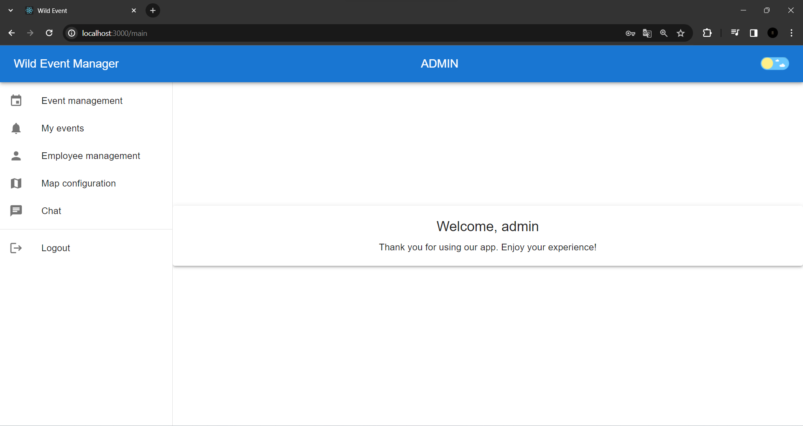
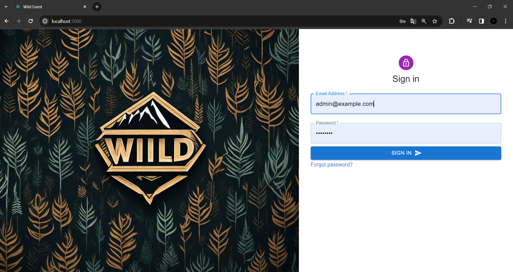
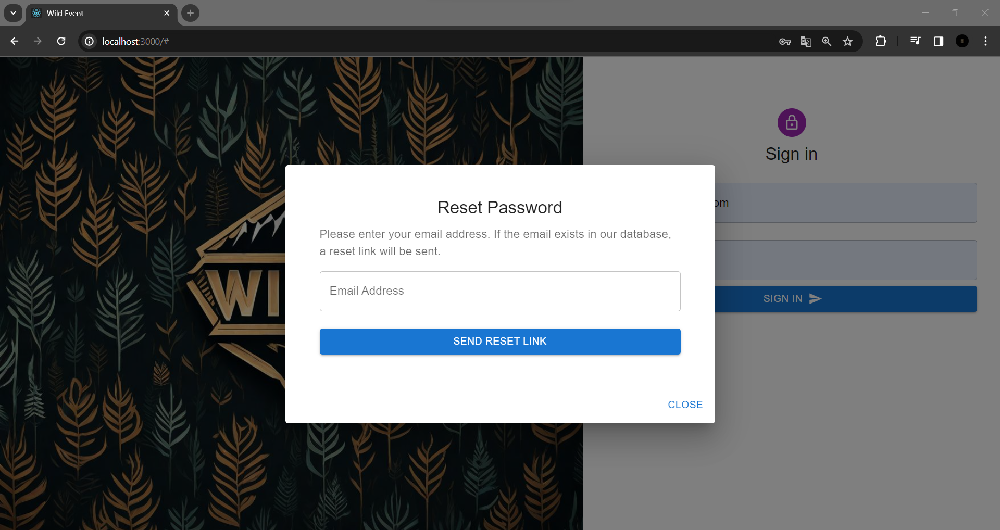
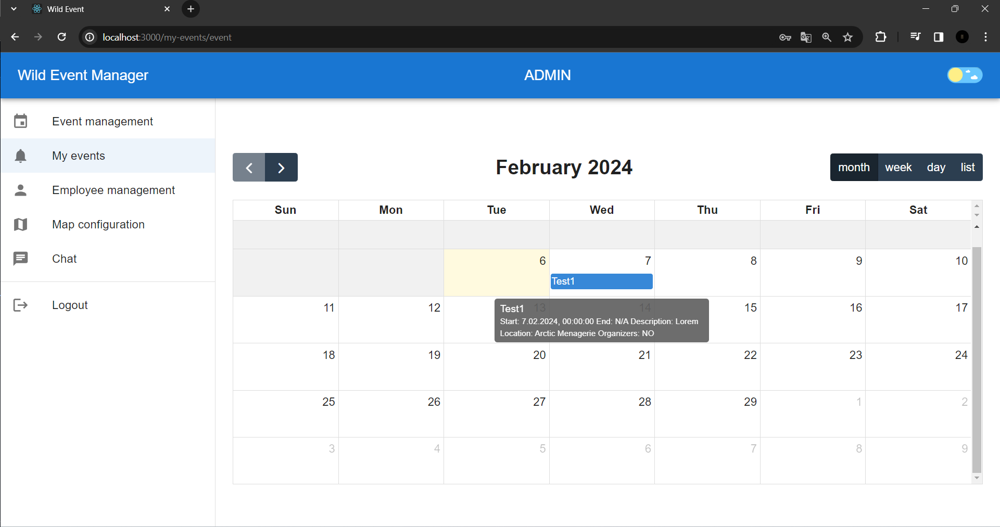
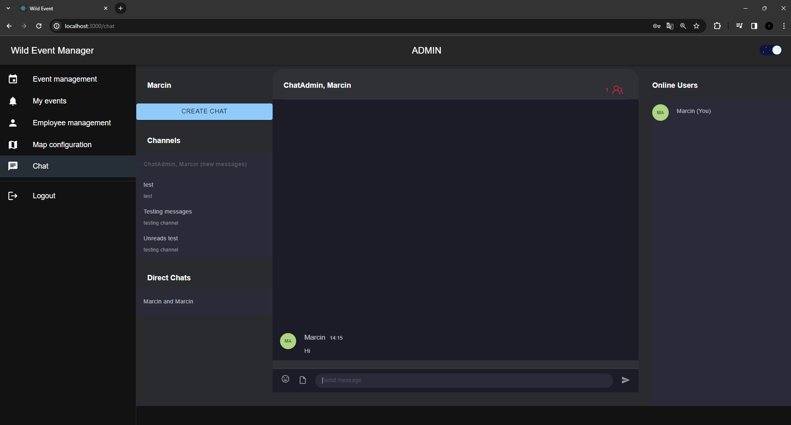
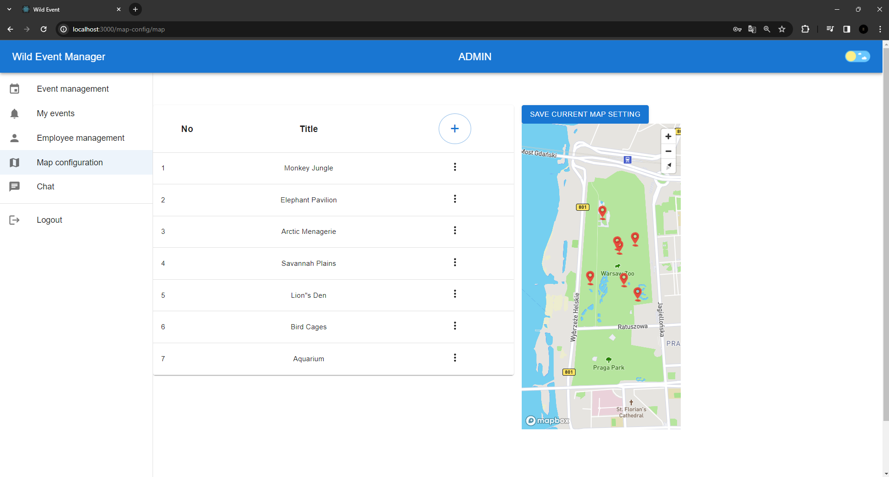
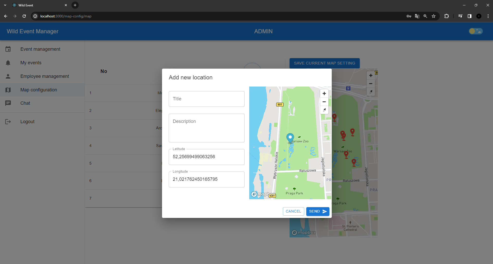
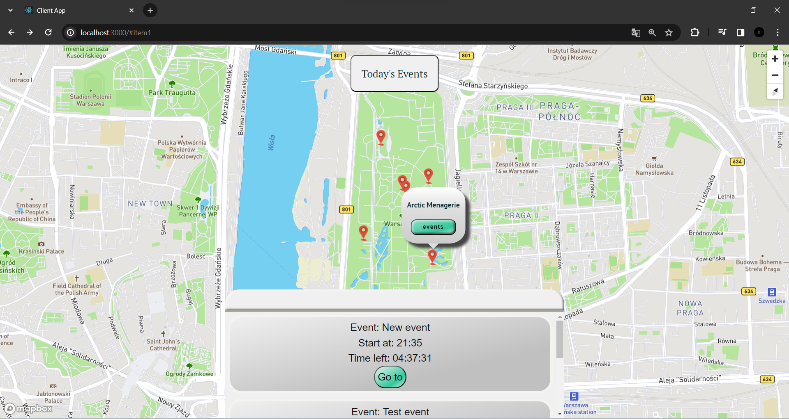
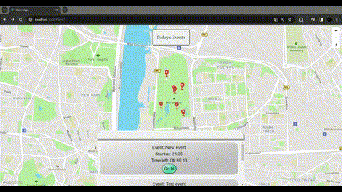

# WILD EVENT MANAGER - FRONTEND BACKOFFICE

 

Here you can find other repositories for this project: 

 1. [BACKOFFICE](https://github.com/marcinlewinski/EventManager_Backoffice)
 2. [CLIENT APP](https://github.com/marcinlewinski/EventManager_client)

## 🌟 Project aim

  
The project is a server application designed to streamline the process of organizing various events within a specific area. It serves as a significant component of a larger project, functioning as a backlog for managing planning, coordination, and progress tracking of event organization.
The server is responsible for facilitating RESTful communication between two client applications(CLIENT APP and BACKOFFICE).

## 📖 Table of contents

- [Team](#-team)

- [To do](#-to-do)

- [Features](#-features)

- [Project status](#-project-status)

- [Demo](#-demo)

- [Technologies](#%EF%B8%8F-technologies--tools)

- [License](#-license)

## 👥 Team

  

Mentors: Michał Kruczkowski

  

- [Michał Zuzak](https://github.com/michalz18)

- [Wiktoria Kulczyńska](https://github.com/wiktoria75)

- [Marcin Lewiński](https://github.com/marcinlewinski)

- [Artur Pokora](https://github.com/ArtIPok)

  

## 📝 To do

  

- Add map legend for clients app

- End to end tests

- Implement CI/CD

  

## ✨ Features

  

- Event Management:
The application allows for the creation, editing, and deletion of events, facilitating efficient planning and updating of event schedules for organizers.

- Event Calendar:
It features an interactive calendar presenting dates and times of various events in a clear manner, aiding both organizers and participants in tracking event schedules.

- Resource Management:
The application enables the management of resources essential for event organization, such as venues, and personnel, ensuring their availability and effective utilization.

- Team Communication:
It offers internal communication features, facilitating rapid information exchange among members of the organizational team and enhancing effective coordination of activities.

- Integration of Map with Event Location:
The application allows for the integration of a map displaying the event location, aiding participant orientation and providing additional information about the surroundings.

- Application Responsiveness:
The project is designed with responsiveness in mind, meaning that the application adjusts to different screen sizes, allowing convenient use on computers, tablets, and smartphones.

- Assigning Locations to Events:
Organizers have the ability to assign specific locations to individual events, streamlining planning and increasing transparency regarding the venues for various events.

  

## 🟢 Project status

  

This project is considered complete and stable, and all planned features have been implemented. While we will address any critical issues that arise.

  

Thank you for your interest in this project. We hope that you find it useful. Please feel free to fork this repository and use it as a starting point for your own project, or to learn from the code.

  
## 🖼️ Demo 

| BACKOFFICE |
|:-------------------------:|
|  |

| SignIn | Password reset  |
|:-------------------------:|:-------------------------:|
|  |  |

| My events |  Chat |
|:-------------------------:|:-------------------------:|
|  |  |

| Map config | New Location |
|:-------------------------:|:-------------------------:|
|  |  |

| Add event | New employee  |
|:-------------------------:|:-------------------------:|
|  |  |

| CLIENT APP |
|:-------------------------:|
|  |

| Context | Start event counting time |
|:-------------------------:|:-------------------------:|
|  |  |

## 🛠️ Technologies & Tools

  

Project is created with:

   

   

 

## 📜 License
WildEventManager is MIT licensed.
